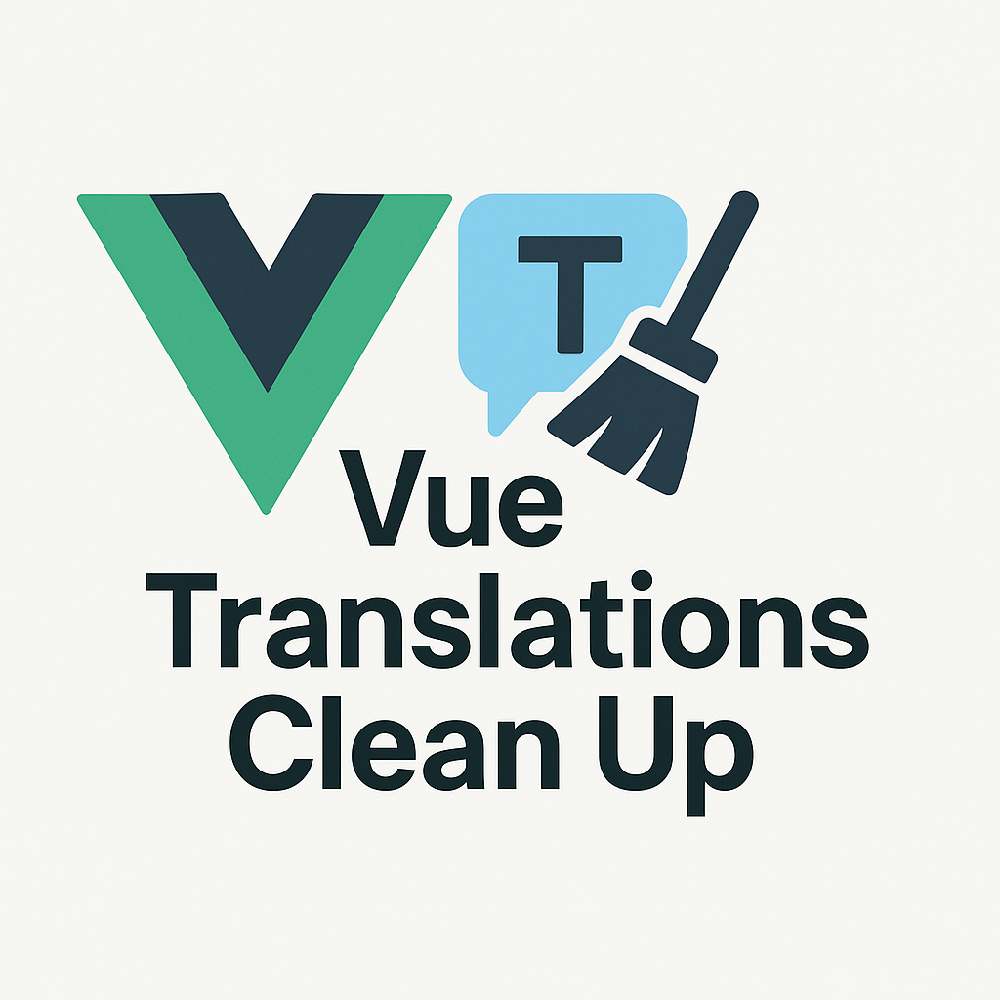

# vue-translations-cleanup

<p align="center">
  
</p>

<p align="center">
  <a href="https://www.npmjs.com/package/vue-translations-cleanup"></a>
  <a href="https://github.com/butaminas/vue-translations-cleanup/blob/main/LICENSE"></a>
  <a href="https://vuejs.org/"></a>
  <a href="https://nuxt.com/"></a>
</p>

A powerful CLI tool for Vue.js and Nuxt i18n projects:
- **Cleanup Mode**: Remove unused translation keys
- **Extract Mode**: Convert raw strings to i18n automatically
- **AI-Powered**: Auto-translate to multiple languages (optional)

## Quick Start

```bash
# Install
npm install -D vue-translations-cleanup

# Generate config with auto-detected settings (recommended)
npx vue-translations-cleanup --init

# Remove unused translations
npx vue-translations-cleanup

# Extract raw strings to i18n
npx vue-translations-cleanup --extract -t ./locales/en.json -s ./src
```

## Features

### Cleanup Mode (default)
- Auto-detects Vue 3, Nuxt 3/4 projects
- Removes unused translation keys
- Supports nested keys and pruning
- Dry-run mode and automatic backups

### Extract Mode
- Finds hardcoded translatable strings
- Generates semantic translation keys
- Replaces strings with i18n calls
- Auto-injects imports when needed

### AI-Powered Auto-Translation

Automatically translate extracted keys to multiple languages:

```typescript
// vue-translations-cleanup.config.ts
export default {
  ai: {
    enabled: true,
    provider: 'ollama',  // or 'anthropic', 'openai'
    model: 'codellama',
    languages: ['de', 'fr', 'es']  // Auto-translate to these
  }
}
```

**Result:**
```
locales/en.json: { "greeting": "Hello" }
locales/de.json: { "greeting": "Hallo" }      <- AI translated
locales/fr.json: { "greeting": "Bonjour" }    <- AI translated
```

## CLI Options

```bash
Options:
  --init                         Generate config file with detected settings
  --extract                      Extract raw strings (instead of cleanup)
  -t, --translation-file <path>  Translation file or directory
  -s, --src-path <path>          Source files path
  -c, --config <path>            Config file path
  -n, --dry-run                  Preview changes without writing
  --no-backup                    Skip backup creation
  -v, --verbose                  Show detailed output
  -h, --help                     Display help
```

## Configuration

Create `vue-translations-cleanup.config.ts` for advanced features:

```typescript
export default {
  extract: {
    targetLanguage: 'en',
    keyFormat: 'snake_case',  // or 'camelCase', 'kebab-case', 'dot.case'
  },
  ai: {
    enabled: true,
    provider: 'ollama',
    model: 'codellama',
    languages: ['de', 'fr'],
  },
}
```

### Custom i18n Patterns

```typescript
export default {
  extract: {
    i18nPatterns: [
      {
        pattern: /const\s*{\s*i18n:\s*{\s*t\s*}\s*}\s*=\s*injectContext\(\)/,
        functionName: 't',
        importTemplate: 'const { i18n: { t } } = injectContext()',
        importStatement: "import { injectContext } from '@/plugins/context'",
        injectLocation: 'script-setup',
      }
    ]
  }
}
```

## Compatibility

| Package | Minimum Version | Notes |
|---------|-----------------|-------|
| Vue | 3.3.0+ | Composition API required |
| Nuxt | 3.0.0+ | Including Nuxt 4 |
| vue-i18n | 9.0.0+ | Intlify ecosystem |
| @nuxtjs/i18n | 8.0.0+ | For Nuxt projects |
| Node.js | 18.0.0+ | Required runtime |

## Documentation

**[Full Documentation](https://butaminas.github.io/vue-translations-cleanup/)**

- [Getting Started](https://butaminas.github.io/vue-translations-cleanup/guide/getting-started)
- [Cleanup Mode](https://butaminas.github.io/vue-translations-cleanup/guide/cleanup-mode)
- [Extract Mode](https://butaminas.github.io/vue-translations-cleanup/guide/extract-mode)
- [AI Features](https://butaminas.github.io/vue-translations-cleanup/guide/ai-features)
- [Configuration](https://butaminas.github.io/vue-translations-cleanup/guide/config-file)

## Contributing

Contributions are welcome! Please see [CONTRIBUTING.md](./CONTRIBUTING.md) for guidelines.

## License

MIT © [Mindaugas Kristutis](https://github.com/butaminas)
